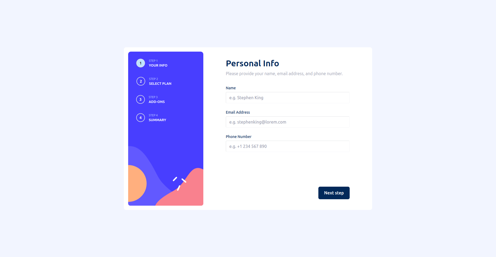

# Frontend Mentor - Multi-step form solution

This is a solution to the [Multi-step form challenge on Frontend Mentor](https://www.frontendmentor.io/challenges/multistep-form-YVAnSdqQBJ). Frontend Mentor challenges help you improve your coding skills by building realistic projects. 

## Table of contents

- [Overview](#overview)
  - [The challenge](#the-challenge)
  - [Screenshot](#screenshot)
  - [Links](#links)
- [My process](#my-process)
  - [Built with](#built-with)
  - [Useful resources](#useful-resources)
- [Author](#author)

## Overview

### The challenge

Users should be able to:

- Complete each step of the sequence
- Go back to a previous step to update their selections
- See a summary of their selections on the final step and confirm their order
- View the optimal layout for the interface depending on their device's screen size
- See hover and focus states for all interactive elements on the page
- Receive form validation messages if:
  - A field has been missed
  - The email address is not formatted correctly
  - A step is submitted, but no selection has been made

### Screenshot

### Links

- Solution URL: [Here](https://github.com/ferdinandoaspro/multi-step-form)
- Live Site URL: [Here](https://multi-step-form-one-self.vercel.app/)

## My process

### Built with

- Semantic HTML5 markup
- SCSS custom properties
- Flexbox
- CSS Grid
- Mobile-first workflow
- [React](https://react.dev/) - JS library
- [Bootstrap](https://getbootstrap.com/) - For styles
- [Typescript](https://www.typescriptlang.org/docs/)

### Useful resources

- [The official React Documentation](https://react.dev/)
- [The official Bootstrap Documentation](https://getbootstrap.com/docs/5.3/getting-started/introduction/)
- [The Typescript Documentation](https://www.typescriptlang.org/docs/)

## Author

- Github - [Ferdinando Aspro](https://github.com/ferdinandoaspro)
- Frontend Mentor - [@ferdinandoaspro](https://www.frontendmentor.io/profile/ferdinandoaspro)
